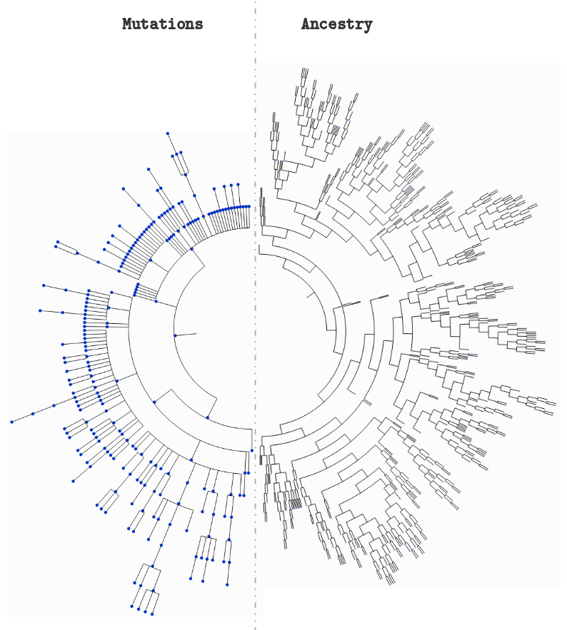

# CellSystem

> Let cells do their own thing while you silently observe them.

A simple framework that allows (or will allow) you to couple seamlessly a custom observer (logger) to your simulations.

This was created to simulate cancer growth, while allowing to couple mutations and ancestry logging to study tumour philogeny reconstruction algorithms.



## Example

A use case integrated in the repository:


```python
from cellsystem import *

# The cell system will simulate cell growth
# while the log tracks the steps in that process.
sys = CellSystem()
log = FullLog()
```


```python
# Initialize the first cell
sys.seed(log=log)
```

    New cell 0 added @ (5, 5)


```python
# Take 35 steps forward in time
sys.step(30, log=log)
```

    Cell no. 0 dividing @ (5, 5)
    	New cells: 2 @ (4, 5) and 1 @ (6, 6)
    Cell no. 2 mutating @ site (4, 5) (father 0)
    		 Initial mutations: []
                    	 Initial genome: AAAAAAAAAA
    		 Final mutations: [(3, 'C')]
                    	 Final genome: AAACAAAAAA
    Cell no. 1 dividing @ (6, 6)
    	New cells: 4 @ (6, 6) and 3 @ (5, 6)
    Cell no. 2 death @ site (4, 5) (father 0)
    Cell no. 3 migrating from site (5, 6) (father 1)
    	 New site: (4, 5)
    Cell no. 4 death @ site (6, 6) (father 1)
    Cell no. 3 dividing @ (4, 5)
    	New cells: 6 @ (3, 6) and 5 @ (3, 5)
    Cell no. 6 dividing @ (3, 6)
    	New cells: 8 @ (2, 6) and 7 @ (3, 5)
    Cell no. 5 migrating from site (3, 5) (father 3)
    	 New site: (4, 5)
    Cell no. 8 dividing @ (2, 6)
    	New cells: 10 @ (3, 6) and 9 @ (1, 7)
    Cell no. 7 mutating @ site (3, 5) (father 6)
    		 Initial mutations: [(3, 'C')]
                    	 Initial genome: AAACAAAAAA
    		 Final mutations: [(3, 'C'), (6, 'C')]
                    	 Final genome: AAACAACAAA
    Cell no. 5 death @ site (4, 5) (father 3)
    Cell no. 7 dividing @ (3, 5)
    	New cells: 12 @ (3, 4) and 11 @ (2, 5)
    Cell no. 10 migrating from site (3, 6) (father 8)
    	 New site: (3, 7)
    Cell no. 9 dividing @ (1, 7)
    	New cells: 14 @ (2, 6) and 13 @ (0, 8)
    Cell no. 14 migrating from site (2, 6) (father 9)
    	 New site: (3, 5)
    Cell no. 10 dividing @ (3, 7)
    	New cells: 16 @ (2, 6) and 15 @ (3, 8)
    Cell no. 12 migrating from site (3, 4) (father 7)
    	 New site: (3, 5)
    Cell no. 11 migrating from site (2, 5) (father 7)
    	 New site: (2, 5)
    Cell no. 13 dividing @ (0, 8)
    	New cells: 18 @ (1, 9) and 17 @ (9, 7)
    Cell no. 15 migrating from site (3, 8) (father 10)
    	 New site: (2, 7)
    Cell no. 17 mutating @ site (9, 7) (father 13)
    		 Initial mutations: []
                    	 Initial genome: AAAAAAAAAA
    		 Final mutations: [(8, 'T')]
                    	 Final genome: AAAAAAAATA
    Cell no. 11 death @ site (2, 5) (father 7)
    Cell no. 16 mutating @ site (2, 6) (father 10)
    		 Initial mutations: []
                    	 Initial genome: AAAAAAAAAA
    		 Final mutations: [(2, 'C')]
                    	 Final genome: AACAAAAAAA
    Cell no. 18 migrating from site (1, 9) (father 13)
    	 New site: (1, 8)
    Cell no. 12 dividing @ (3, 5)
    	New cells: 20 @ (3, 6) and 19 @ (4, 6)
    Cell no. 14 mutating @ site (3, 5) (father 9)
    		 Initial mutations: []
                    	 Initial genome: AAAAAAAAAA
    		 Final mutations: [(2, 'G')]
                    	 Final genome: AAGAAAAAAA
    Cell no. 16 migrating from site (2, 6) (father 10)
    	 New site: (1, 7)
    Cell no. 17 dividing @ (9, 7)
    	New cells: 22 @ (9, 7) and 21 @ (8, 6)
    Cell no. 15 dividing @ (2, 7)
    	New cells: 24 @ (3, 6) and 23 @ (3, 6)
    Cell no. 18 mutating @ site (1, 8) (father 13)
    		 Initial mutations: []
                    	 Initial genome: AAAAAAAAAA
    		 Final mutations: [(2, 'A')]
                    	 Final genome: AAAAAAAAAA
    Cell no. 20 migrating from site (3, 6) (father 12)
    	 New site: (4, 6)
    Cell no. 14 mutating @ site (3, 5) (father 9)
    		 Initial mutations: [(2, 'G')]
                    	 Initial genome: AAGAAAAAAA
    		 Final mutations: [(2, 'G'), (6, 'T')]
                    	 Final genome: AAGAAATAAA
    Cell no. 24 migrating from site (3, 6) (father 15)
    	 New site: (2, 7)
    Cell no. 22 mutating @ site (9, 7) (father 17)
    		 Initial mutations: [(8, 'T')]
                    	 Initial genome: AAAAAAAATA
    		 Final mutations: [(8, 'T'), (9, 'A')]
                    	 Final genome: AAAAAAAATA
    Cell no. 19 death @ site (4, 6) (father 12)
    Cell no. 23 dividing @ (3, 6)
    	New cells: 26 @ (2, 6) and 25 @ (2, 5)
    Cell no. 14 mutating @ site (3, 5) (father 9)
    		 Initial mutations: [(2, 'G'), (6, 'T')]
                    	 Initial genome: AAGAAATAAA
    		 Final mutations: [(2, 'G'), (6, 'T'), (1, 'G')]
                    	 Final genome: AGGAAATAAA
    Cell no. 21 death @ site (8, 6) (father 17)
    Cell no. 18 dividing @ (1, 8)
    	New cells: 28 @ (1, 7) and 27 @ (0, 7)
    Cell no. 20 death @ site (4, 6) (father 12)
    Cell no. 16 migrating from site (1, 7) (father 10)
    	 New site: (1, 6)
    Cell no. 14 dividing @ (3, 5)
    	New cells: 30 @ (2, 5) and 29 @ (4, 6)
    Cell no. 22 dividing @ (9, 7)
    	New cells: 32 @ (8, 8) and 31 @ (8, 7)
    Cell no. 25 death @ site (2, 5) (father 23)
    Cell no. 26 death @ site (2, 6) (father 23)
    Cell no. 24 migrating from site (2, 7) (father 15)
    	 New site: (3, 8)
    Cell no. 27 migrating from site (0, 7) (father 18)
    	 New site: (1, 7)
    Cell no. 28 migrating from site (1, 7) (father 18)
    	 New site: (1, 8)
    Cell no. 16 mutating @ site (1, 6) (father 10)
    		 Initial mutations: [(2, 'C')]
                    	 Initial genome: AACAAAAAAA
    		 Final mutations: [(2, 'C'), (9, 'A')]
                    	 Final genome: AACAAAAAAA
    Cell no. 24 dividing @ (3, 8)
    	New cells: 34 @ (2, 8) and 33 @ (2, 7)
    Cell no. 29 migrating from site (4, 6) (father 14)
    	 New site: (4, 7)
    Cell no. 16 migrating from site (1, 6) (father 10)
    	 New site: (0, 6)
    Cell no. 27 dividing @ (1, 7)
    	New cells: 36 @ (0, 7) and 35 @ (1, 6)
    Cell no. 28 migrating from site (1, 8) (father 18)
    	 New site: (0, 8)
    Cell no. 30 dividing @ (2, 5)
    	New cells: 38 @ (2, 5) and 37 @ (2, 6)
    Cell no. 38 dividing @ (2, 5)
    	New cells: 40 @ (3, 6) and 39 @ (2, 4)
    Cell no. 29 dividing @ (4, 7)
    	New cells: 42 @ (5, 8) and 41 @ (5, 8)
    Cell no. 28 mutating @ site (0, 8) (father 18)
    		 Initial mutations: [(2, 'A')]
                    	 Initial genome: AAAAAAAAAA
    		 Final mutations: [(2, 'A'), (5, 'T')]
                    	 Final genome: AAAAATAAAA
    Cell no. 35 death @ site (1, 6) (father 27)
    Cell no. 32 mutating @ site (8, 8) (father 22)
    		 Initial mutations: [(8, 'T'), (9, 'A')]
                    	 Initial genome: AAAAAAAATA
    		 Final mutations: [(8, 'T'), (9, 'A'), (1, 'G')]
                    	 Final genome: AGAAAAAATA
    Cell no. 33 migrating from site (2, 7) (father 24)
    	 New site: (1, 7)
    Cell no. 37 mutating @ site (2, 6) (father 30)
    		 Initial mutations: [(2, 'G'), (6, 'T'), (1, 'G')]
                    	 Initial genome: AGGAAATAAA
    		 Final mutations: [(2, 'G'), (6, 'T'), (1, 'G'), (1, 'C')]
                    	 Final genome: ACGAAATAAA
    Cell no. 34 death @ site (2, 8) (father 24)
    Cell no. 16 mutating @ site (0, 6) (father 10)
    		 Initial mutations: [(2, 'C'), (9, 'A')]
                    	 Initial genome: AACAAAAAAA
    		 Final mutations: [(2, 'C'), (9, 'A'), (7, 'T')]
                    	 Final genome: AACAAAATAA
    Cell no. 36 death @ site (0, 7) (father 27)
    Cell no. 31 mutating @ site (8, 7) (father 22)
    		 Initial mutations: [(8, 'T'), (9, 'A')]
                    	 Initial genome: AAAAAAAATA
    		 Final mutations: [(8, 'T'), (9, 'A'), (1, 'C')]
                    	 Final genome: ACAAAAAATA
    Cell no. 37 death @ site (2, 6) (father 30)
    Cell no. 33 death @ site (1, 7) (father 24)
    Cell no. 16 death @ site (0, 6) (father 10)
    Cell no. 28 mutating @ site (0, 8) (father 18)
    		 Initial mutations: [(2, 'A'), (5, 'T')]
                    	 Initial genome: AAAAATAAAA
    		 Final mutations: [(2, 'A'), (5, 'T'), (8, 'T')]
                    	 Final genome: AAAAATAATA
    Cell no. 32 migrating from site (8, 8) (father 22)
    	 New site: (8, 8)
    Cell no. 41 dividing @ (5, 8)
    	New cells: 44 @ (6, 7) and 43 @ (5, 7)
    Cell no. 31 death @ site (8, 7) (father 22)
    Cell no. 39 migrating from site (2, 4) (father 38)
    	 New site: (3, 4)
    Cell no. 42 migrating from site (5, 8) (father 29)
    	 New site: (5, 8)
    Cell no. 39 mutating @ site (3, 4) (father 38)
    		 Initial mutations: [(2, 'G'), (6, 'T'), (1, 'G')]
                    	 Initial genome: AGGAAATAAA
    		 Final mutations: [(2, 'G'), (6, 'T'), (1, 'G'), (0, 'G')]
                    	 Final genome: GGGAAATAAA
    Cell no. 44 mutating @ site (6, 7) (father 41)
    		 Initial mutations: [(2, 'G'), (6, 'T'), (1, 'G')]
                    	 Initial genome: AGGAAATAAA
    		 Final mutations: [(2, 'G'), (6, 'T'), (1, 'G'), (9, 'T')]
                    	 Final genome: AGGAAATAAT
    Cell no. 32 dividing @ (8, 8)
    	New cells: 46 @ (7, 8) and 45 @ (9, 9)
    Cell no. 43 death @ site (5, 7) (father 41)
    Cell no. 40 death @ site (3, 6) (father 38)
    Cell no. 46 migrating from site (7, 8) (father 32)
    	 New site: (8, 8)
    Cell no. 39 death @ site (3, 4) (father 38)
    Cell no. 44 mutating @ site (6, 7) (father 41)
    		 Initial mutations: [(2, 'G'), (6, 'T'), (1, 'G'), (9, 'T')]
                    	 Initial genome: AGGAAATAAT
    		 Final mutations: [(2, 'G'), (6, 'T'), (1, 'G'), (9, 'T'), (0, 'C')]
                    	 Final genome: CGGAAATAAT
    Cell no. 45 death @ site (9, 9) (father 32)
    Cell no. 28 migrating from site (0, 8) (father 18)
    	 New site: (0, 8)
    Cell no. 42 migrating from site (5, 8) (father 29)
    	 New site: (4, 7)
    Cell no. 42 migrating from site (4, 7) (father 29)
    	 New site: (3, 7)
    Cell no. 44 death @ site (6, 7) (father 41)
    Cell no. 46 migrating from site (8, 8) (father 32)
    	 New site: (7, 8)
    Cell no. 28 mutating @ site (0, 8) (father 18)
    		 Initial mutations: [(2, 'A'), (5, 'T'), (8, 'T')]
                    	 Initial genome: AAAAATAATA
    		 Final mutations: [(2, 'A'), (5, 'T'), (8, 'T'), (3, 'A')]
                    	 Final genome: AAAAATAATA
    Cell no. 46 dividing @ (7, 8)
    	New cells: 48 @ (7, 9) and 47 @ (8, 8)
    Cell no. 28 migrating from site (0, 8) (father 18)
    	 New site: (1, 7)
    Cell no. 42 dividing @ (3, 7)
    	New cells: 50 @ (2, 6) and 49 @ (4, 8)
    Cell no. 47 migrating from site (8, 8) (father 46)
    	 New site: (7, 9)
    Cell no. 49 dividing @ (4, 8)
    	New cells: 52 @ (5, 7) and 51 @ (5, 9)
    Cell no. 50 migrating from site (2, 6) (father 42)
    	 New site: (3, 5)
    Cell no. 48 death @ site (7, 9) (father 46)
    Cell no. 52 mutating @ site (5, 7) (father 49)
    		 Initial mutations: [(2, 'G'), (6, 'T'), (1, 'G')]
                    	 Initial genome: AGGAAATAAA
    		 Final mutations: [(2, 'G'), (6, 'T'), (1, 'G'), (9, 'C')]
                    	 Final genome: AGGAAATAAC
    Cell no. 28 mutating @ site (1, 7) (father 18)
    		 Initial mutations: [(2, 'A'), (5, 'T'), (8, 'T'), (3, 'A')]
                    	 Initial genome: AAAAATAATA
    		 Final mutations: [(2, 'A'), (5, 'T'), (8, 'T'), (3, 'A'), (3, 'G')]
                    	 Final genome: AAAGATAATA
    Cell no. 47 dividing @ (7, 9)
    	New cells: 54 @ (7, 9) and 53 @ (6, 8)
    Cell no. 50 dividing @ (3, 5)
    	New cells: 56 @ (3, 5) and 55 @ (4, 4)
    Cell no. 55 death @ site (4, 4) (father 50)
    Cell no. 53 migrating from site (6, 8) (father 47)
    	 New site: (7, 7)
    Cell no. 56 death @ site (3, 5) (father 50)
    Cell no. 52 death @ site (5, 7) (father 49)
    Cell no. 28 dividing @ (1, 7)
    	New cells: 58 @ (2, 7) and 57 @ (1, 6)
    Cell no. 51 mutating @ site (5, 9) (father 49)
    		 Initial mutations: [(2, 'G'), (6, 'T'), (1, 'G')]
                    	 Initial genome: AGGAAATAAA
    		 Final mutations: [(2, 'G'), (6, 'T'), (1, 'G'), (9, 'T')]
                    	 Final genome: AGGAAATAAT
    Cell no. 54 migrating from site (7, 9) (father 47)
    	 New site: (7, 8)
    Cell no. 57 migrating from site (1, 6) (father 28)
    	 New site: (1, 7)
    Cell no. 51 dividing @ (5, 9)
    	New cells: 60 @ (4, 0) and 59 @ (4, 0)
    Cell no. 53 dividing @ (7, 7)
    	New cells: 62 @ (8, 7) and 61 @ (8, 8)
    Cell no. 54 migrating from site (7, 8) (father 47)
    	 New site: (6, 9)
    Cell no. 58 migrating from site (2, 7) (father 28)
    	 New site: (3, 8)
    Cell no. 58 dividing @ (3, 8)
    	New cells: 64 @ (3, 9) and 63 @ (4, 7)
    Cell no. 57 mutating @ site (1, 7) (father 28)
    		 Initial mutations: [(2, 'A'), (5, 'T'), (8, 'T'), (3, 'A'), (3, 'G')]
                    	 Initial genome: AAAGATAATA
    		 Final mutations: [(2, 'A'), (5, 'T'), (8, 'T'), (3, 'A'), (3, 'G'), (9, 'T')]
                    	 Final genome: AAAGATAATT
    Cell no. 54 death @ site (6, 9) (father 47)
    Cell no. 62 mutating @ site (8, 7) (father 53)
    		 Initial mutations: [(8, 'T'), (9, 'A'), (1, 'G')]
                    	 Initial genome: AGAAAAAATA
    		 Final mutations: [(8, 'T'), (9, 'A'), (1, 'G'), (1, 'C')]
                    	 Final genome: ACAAAAAATA
    Cell no. 60 dividing @ (4, 0)
    	New cells: 66 @ (5, 0) and 65 @ (4, 1)
    Cell no. 59 mutating @ site (4, 0) (father 51)
    		 Initial mutations: [(2, 'G'), (6, 'T'), (1, 'G'), (9, 'T')]
                    	 Initial genome: AGGAAATAAT
    		 Final mutations: [(2, 'G'), (6, 'T'), (1, 'G'), (9, 'T'), (9, 'T')]
                    	 Final genome: AGGAAATAAT
    Cell no. 61 mutating @ site (8, 8) (father 53)
    		 Initial mutations: [(8, 'T'), (9, 'A'), (1, 'G')]
                    	 Initial genome: AGAAAAAATA
    		 Final mutations: [(8, 'T'), (9, 'A'), (1, 'G'), (4, 'G')]
                    	 Final genome: AGAAGAAATA
    Cell no. 59 dividing @ (4, 0)
    	New cells: 68 @ (3, 0) and 67 @ (5, 0)
    Cell no. 61 mutating @ site (8, 8) (father 53)
    		 Initial mutations: [(8, 'T'), (9, 'A'), (1, 'G'), (4, 'G')]
                    	 Initial genome: AGAAGAAATA
    		 Final mutations: [(8, 'T'), (9, 'A'), (1, 'G'), (4, 'G'), (6, 'G')]
                    	 Final genome: AGAAGAGATA
    Cell no. 62 migrating from site (8, 7) (father 53)
    	 New site: (7, 7)
    Cell no. 63 mutating @ site (4, 7) (father 58)
    		 Initial mutations: [(2, 'A'), (5, 'T'), (8, 'T'), (3, 'A'), (3, 'G')]
                    	 Initial genome: AAAGATAATA
    		 Final mutations: [(2, 'A'), (5, 'T'), (8, 'T'), (3, 'A'), (3, 'G'), (0, 'G')]
                    	 Final genome: GAAGATAATA
    Cell no. 57 mutating @ site (1, 7) (father 28)
    		 Initial mutations: [(2, 'A'), (5, 'T'), (8, 'T'), (3, 'A'), (3, 'G'), (9, 'T')]
                    	 Initial genome: AAAGATAATT
    		 Final mutations: [(2, 'A'), (5, 'T'), (8, 'T'), (3, 'A'), (3, 'G'), (9, 'T'), (4, 'T')]
                    	 Final genome: AAAGTTAATT
    Cell no. 64 dividing @ (3, 9)
    	New cells: 70 @ (4, 8) and 69 @ (3, 8)
    Cell no. 65 dividing @ (4, 1)
    	New cells: 72 @ (3, 2) and 71 @ (5, 0)
    Cell no. 66 dividing @ (5, 0)
    	New cells: 74 @ (5, 1) and 73 @ (5, 0)
    Cell no. 73 mutating @ site (5, 0) (father 66)
    		 Initial mutations: [(2, 'G'), (6, 'T'), (1, 'G'), (9, 'T')]
                    	 Initial genome: AGGAAATAAT
    		 Final mutations: [(2, 'G'), (6, 'T'), (1, 'G'), (9, 'T'), (8, 'C')]
                    	 Final genome: AGGAAATACT
    Cell no. 71 migrating from site (5, 0) (father 65)
    	 New site: (6, 0)
    Cell no. 62 death @ site (7, 7) (father 53)
    Cell no. 70 dividing @ (4, 8)
    	New cells: 76 @ (4, 9) and 75 @ (5, 8)
    Cell no. 69 dividing @ (3, 8)
    	New cells: 78 @ (3, 7) and 77 @ (3, 7)
    Cell no. 61 dividing @ (8, 8)
    	New cells: 80 @ (8, 8) and 79 @ (7, 9)
    Cell no. 68 mutating @ site (3, 0) (father 59)
    		 Initial mutations: [(2, 'G'), (6, 'T'), (1, 'G'), (9, 'T'), (9, 'T')]
                    	 Initial genome: AGGAAATAAT
    		 Final mutations: [(2, 'G'), (6, 'T'), (1, 'G'), (9, 'T'), (9, 'T'), (3, 'G')]
                    	 Final genome: AGGGAATAAT
    Cell no. 63 mutating @ site (4, 7) (father 58)
    		 Initial mutations: [(2, 'A'), (5, 'T'), (8, 'T'), (3, 'A'), (3, 'G'), (0, 'G')]
                    	 Initial genome: GAAGATAATA
    		 Final mutations: [(2, 'A'), (5, 'T'), (8, 'T'), (3, 'A'), (3, 'G'), (0, 'G'), (7, 'G')]
                    	 Final genome: GAAGATAGTA
    Cell no. 72 dividing @ (3, 2)
    	New cells: 82 @ (2, 1) and 81 @ (4, 1)
    Cell no. 57 mutating @ site (1, 7) (father 28)
    		 Initial mutations: [(2, 'A'), (5, 'T'), (8, 'T'), (3, 'A'), (3, 'G'), (9, 'T'), (4, 'T')]
                    	 Initial genome: AAAGTTAATT
    		 Final mutations: [(2, 'A'), (5, 'T'), (8, 'T'), (3, 'A'), (3, 'G'), (9, 'T'), (4, 'T'), (3, 'C')]
                    	 Final genome: AAACTTAATT
    Cell no. 74 dividing @ (5, 1)
    	New cells: 84 @ (6, 1) and 83 @ (4, 1)
    Cell no. 63 dividing @ (4, 7)
    	New cells: 86 @ (5, 6) and 85 @ (3, 7)
    Cell no. 79 death @ site (7, 9) (father 61)
    Cell no. 76 mutating @ site (4, 9) (father 70)
    		 Initial mutations: [(2, 'A'), (5, 'T'), (8, 'T'), (3, 'A'), (3, 'G')]
                    	 Initial genome: AAAGATAATA
    		 Final mutations: [(2, 'A'), (5, 'T'), (8, 'T'), (3, 'A'), (3, 'G'), (1, 'G')]
                    	 Final genome: AGAGATAATA
    Cell no. 71 dividing @ (6, 0)
    	New cells: 88 @ (5, 0) and 87 @ (5, 9)
    Cell no. 57 death @ site (1, 7) (father 28)
    Cell no. 82 death @ site (2, 1) (father 72)
    Cell no. 80 dividing @ (8, 8)
    	New cells: 90 @ (9, 9) and 89 @ (7, 8)
    Cell no. 84 mutating @ site (6, 1) (father 74)
    		 Initial mutations: [(2, 'G'), (6, 'T'), (1, 'G'), (9, 'T')]
                    	 Initial genome: AGGAAATAAT
    		 Final mutations: [(2, 'G'), (6, 'T'), (1, 'G'), (9, 'T'), (3, 'T')]
                    	 Final genome: AGGTAATAAT
    Cell no. 68 migrating from site (3, 0) (father 59)
    	 New site: (2, 1)
    Cell no. 78 dividing @ (3, 7)
    	New cells: 92 @ (2, 6) and 91 @ (2, 6)
    Cell no. 73 mutating @ site (5, 0) (father 66)
    		 Initial mutations: [(2, 'G'), (6, 'T'), (1, 'G'), (9, 'T'), (8, 'C')]
                    	 Initial genome: AGGAAATACT
    		 Final mutations: [(2, 'G'), (6, 'T'), (1, 'G'), (9, 'T'), (8, 'C'), (3, 'G')]
                    	 Final genome: AGGGAATACT
    Cell no. 77 mutating @ site (3, 7) (father 69)
    		 Initial mutations: [(2, 'A'), (5, 'T'), (8, 'T'), (3, 'A'), (3, 'G')]
                    	 Initial genome: AAAGATAATA
    		 Final mutations: [(2, 'A'), (5, 'T'), (8, 'T'), (3, 'A'), (3, 'G'), (5, 'C')]
                    	 Final genome: AAAGACAATA
    Cell no. 75 dividing @ (5, 8)
    	New cells: 94 @ (5, 9) and 93 @ (5, 7)
    Cell no. 67 mutating @ site (5, 0) (father 59)
    		 Initial mutations: [(2, 'G'), (6, 'T'), (1, 'G'), (9, 'T'), (9, 'T')]
                    	 Initial genome: AGGAAATAAT
    		 Final mutations: [(2, 'G'), (6, 'T'), (1, 'G'), (9, 'T'), (9, 'T'), (3, 'G')]
                    	 Final genome: AGGGAATAAT
    Cell no. 89 mutating @ site (7, 8) (father 80)
    		 Initial mutations: [(8, 'T'), (9, 'A'), (1, 'G'), (4, 'G'), (6, 'G')]
                    	 Initial genome: AGAAGAGATA
    		 Final mutations: [(8, 'T'), (9, 'A'), (1, 'G'), (4, 'G'), (6, 'G'), (3, 'A')]
                    	 Final genome: AGAAGAGATA
    Cell no. 87 mutating @ site (5, 9) (father 71)
    		 Initial mutations: [(2, 'G'), (6, 'T'), (1, 'G'), (9, 'T')]
                    	 Initial genome: AGGAAATAAT
    		 Final mutations: [(2, 'G'), (6, 'T'), (1, 'G'), (9, 'T'), (8, 'G')]
                    	 Final genome: AGGAAATAGT
    Cell no. 88 death @ site (5, 0) (father 71)
    Cell no. 92 mutating @ site (2, 6) (father 78)
    		 Initial mutations: [(2, 'A'), (5, 'T'), (8, 'T'), (3, 'A'), (3, 'G')]
                    	 Initial genome: AAAGATAATA
    		 Final mutations: [(2, 'A'), (5, 'T'), (8, 'T'), (3, 'A'), (3, 'G'), (7, 'G')]
                    	 Final genome: AAAGATAGTA
    Cell no. 94 migrating from site (5, 9) (father 75)
    	 New site: (5, 9)
    Cell no. 91 mutating @ site (2, 6) (father 78)
    		 Initial mutations: [(2, 'A'), (5, 'T'), (8, 'T'), (3, 'A'), (3, 'G')]
                    	 Initial genome: AAAGATAATA
    		 Final mutations: [(2, 'A'), (5, 'T'), (8, 'T'), (3, 'A'), (3, 'G'), (9, 'A')]
                    	 Final genome: AAAGATAATA
    Cell no. 76 dividing @ (4, 9)
    	New cells: 96 @ (3, 8) and 95 @ (3, 9)
    Cell no. 84 death @ site (6, 1) (father 74)
    Cell no. 81 death @ site (4, 1) (father 72)
    Cell no. 85 migrating from site (3, 7) (father 63)
    	 New site: (4, 8)
    Cell no. 93 migrating from site (5, 7) (father 75)
    	 New site: (4, 8)
    Cell no. 73 death @ site (5, 0) (father 66)
    Cell no. 83 mutating @ site (4, 1) (father 74)
    		 Initial mutations: [(2, 'G'), (6, 'T'), (1, 'G'), (9, 'T')]
                    	 Initial genome: AGGAAATAAT
    		 Final mutations: [(2, 'G'), (6, 'T'), (1, 'G'), (9, 'T'), (7, 'A')]
                    	 Final genome: AGGAAATAAT
    Cell no. 90 migrating from site (9, 9) (father 80)
    	 New site: (8, 8)
    Cell no. 86 death @ site (5, 6) (father 63)
    Cell no. 68 migrating from site (2, 1) (father 59)
    	 New site: (3, 2)


```python
from ete3 import TreeStyle
ts = TreeStyle()
ts.show_leaf_name = True
ts.mode = "c"
ts.arc_start = -135 # 0 degrees = 3 o'clock
ts.arc_span = 270
```


```python
# Lookup the tree formed by cellular division
log.ancestry().render('%%inline', tree_style=ts)
```


```python
# Now, remove cells that are no longer alive
log.ancestry(prune_death=True).render('%%inline', tree_style=ts)
```


```python
# Now, check out the tree formed by the mutations 
log.mutations().render('%%inline', tree_style=ts)
```


```python
# Remove genomes whose representatives are no longer alive
log.mutations(prune_death=True).render('%%inline', tree_style=ts)
```


_For more examples and usage, please refer to the [Wiki](wikigoeshere.com)._

## Meta

Ad115 – [@Andresio115](https://twitter.com/Andresio115) – a.garcia230395@gmail.com

Distributed under the MIT license. See [LICENSE](LICENSE) for more information.

## Contributing

1. Fork it (<https://github.com/Ad115/Cell-System/fork>)
2. Create your feature branch (`git checkout -b feature/fooBar`)
3. Commit your changes (`git commit -am 'Add some fooBar'`)
4. Push to the branch (`git push origin feature/fooBar`)
5. Create a new Pull Request
