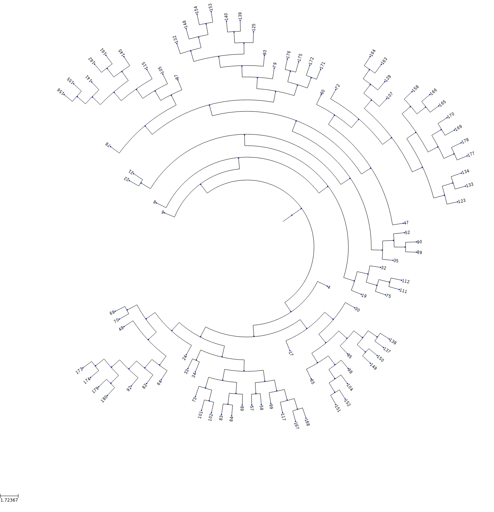
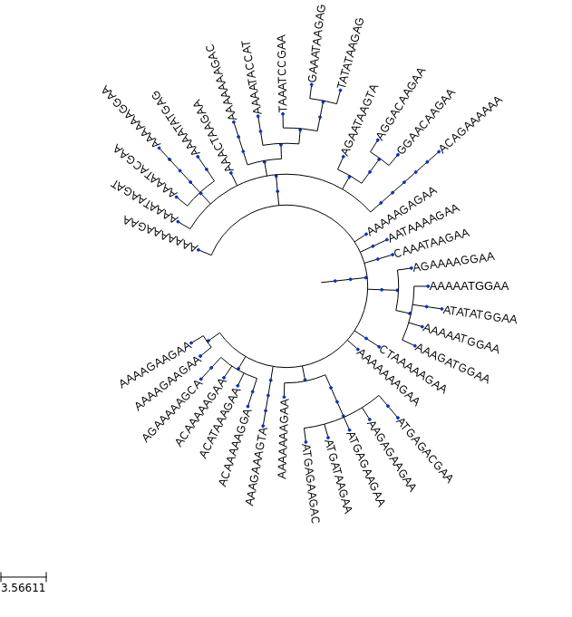

# CellSystem

An agent-based framework for the simulation of biological cell systems (although it could conceivably do more).

This was created to simulate cancer growth, taking into account nutrients and cell migration while allowing to couple mutations and ancestry logging to study tumour phylogeny reconstruction algorithms.


## Example

A use case integrated in the repository:


```python
from cellsystem import *

# The cell system will simulate cell growth
# while tracking the steps in that process.
system = CellSystem(grid_dimensions=(10, 10))

# Initialize the first cell
# in the middle of the grid
system.seed()


   # New cell 0 added @ (5, 5)


# Take 35 steps forward in time
system.run(steps=30)


    # Cell no. 0 dividing @ (5, 5)
    # 	New cells: 2 @ (4, 5) and 1 @ (6, 6)
    # Cell no. 2 mutating @ site (4, 5) (father 0)
    # 		 Initial mutations: []
    #                 	 Initial genome: AAAAAAAAAA
    # 		 Final mutations: [(3, 'C')]
    #                 	 Final genome: AAACAAAAAA
    # Cell no. 1 dividing @ (6, 6)
    # 	New cells: 4 @ (6, 6) and 3 @ (5, 6)
    # Cell no. 2 death @ site (4, 5) (father 0)
    # Cell no. 3 migrating from site (5, 6) (father 1)
    # 	 New site: (4, 5)
    # Cell no. 4 death @ site (6, 6) (father 1)
    # Cell no. 3 dividing @ (4, 5)
    # 	New cells: 6 @ (3, 6) and 5 @ (3, 5)
    # ...
    # ...
    # ...


# Prepare to explore the simulation logs
history = system['log']


# First, let's see the cells' evolution in time and space!
history.geometry().show()

# Remove the cells that died somewhere along the way
history.geometry(prune_death=True).show()
```


```python
# Prepare styling for the trees
tree_style = {'show_leaf_name' : True,
              'mode' : 'c',        # Circular tree
              'arc_start' : -135,  # Degrees
              'arc_span' : 270 }   # Degrees also

# Lookup the tree formed by cellular division
history.ancestry().show(styling=tree_style)

# Now, remove cells that are no longer alive
history.ancestry(prune_death=True).show(styling=tree_style)
```




```python
# Now, check out the tree formed by the mutations 
history.mutations().show(styling=tree_style)

# Remove genomes with no living representatives.
history.mutations(prune_death=True).show(styling=tree_style)
```




_For more examples and usage, please refer to the [Wiki](wikigoeshere.com)._

## Meta

Ad115 – [@Andresio115](https://twitter.com/Andresio115) – a.garcia230395@gmail.com

Distributed under the MIT license. See [LICENSE](LICENSE) for more information.

## Contributing

1. Fork it (<https://github.com/Ad115/Cell-System/fork>)
2. Create your feature branch (`git checkout -b feature/fooBar`)
3. Commit your changes (`git commit -am 'Add some fooBar'`)
4. Push to the branch (`git push origin feature/fooBar`)
5. Create a new Pull Request
