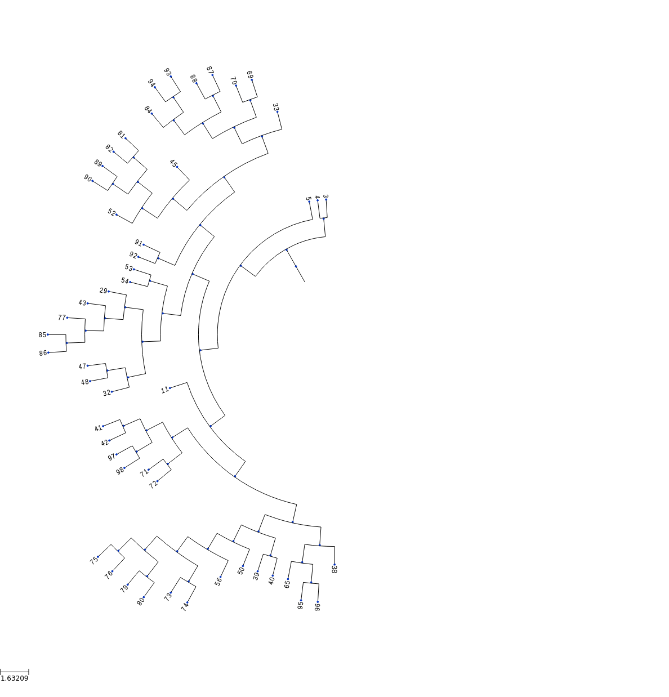
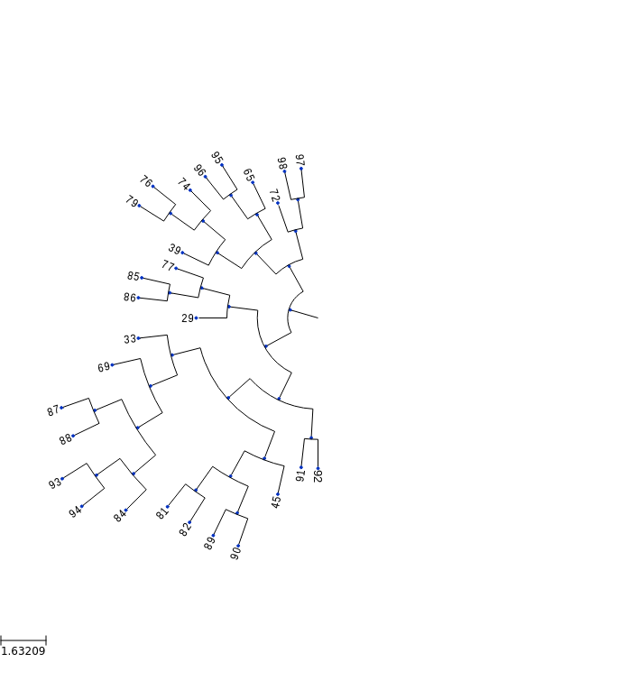

```python
from cellsystem import *

# The cell system will simulate cell growth
# while the log tracks the steps in that process.
sys = CellSystem()
log = FullLog()
```


```python
# Initialize the first cell
sys.seed(log=log)
```

    New cell 0 added @ (5, 5)


```python
# Take 30 steps forward in time
sys.step(30, log=log)
```

    Cell no. 0 mutating @ site (5, 5) (father None)
    		 Initial mutations: []
                    	 Initial genome: AAAAAAAAAA
    		 Final mutations: [(1, 'A')]
                    	 Final genome: AAAAAAAAAA
    Cell no. 0 migrating from site (5, 5) (father None)
    	 New site: (6, 5)
    Cell no. 0 dividing @ (6, 5)
    	New cells: 2 @ (6, 6) and 1 @ (5, 6)
    Cell no. 1 mutating @ site (5, 6) (father None)
    		 Initial mutations: [(1, 'A')]
                    	 Initial genome: AAAAAAAAAA
    		 Final mutations: [(1, 'A'), (3, 'C')]
                    	 Final genome: AAACAAAAAA
    Cell no. 2 mutating @ site (6, 6) (father 0)
    		 Initial mutations: [(1, 'A')]
                    	 Initial genome: AAAAAAAAAA
    		 Final mutations: [(1, 'A'), (1, 'T')]
                    	 Final genome: ATAAAAAAAA
    Cell no. 2 migrating from site (6, 6) (father 0)
    	 New site: (6, 6)
    Cell no. 1 mutating @ site (5, 6) (father None)
    		 Initial mutations: [(1, 'A'), (3, 'C')]
                    	 Initial genome: AAACAAAAAA
    		 Final mutations: [(1, 'A'), (3, 'C'), (1, 'C')]
                    	 Final genome: ACACAAAAAA
    Cell no. 2 mutating @ site (6, 6) (father 0)
    		 Initial mutations: [(1, 'A'), (1, 'T')]
                    	 Initial genome: ATAAAAAAAA
    		 Final mutations: [(1, 'A'), (1, 'T'), (0, 'C')]
                    	 Final genome: CTAAAAAAAA
    Cell no. 1 migrating from site (5, 6) (father None)
    	 New site: (5, 6)
    Cell no. 2 mutating @ site (6, 6) (father 0)
    		 Initial mutations: [(1, 'A'), (1, 'T'), (0, 'C')]
                    	 Initial genome: CTAAAAAAAA
    		 Final mutations: [(1, 'A'), (1, 'T'), (0, 'C'), (7, 'T')]
                    	 Final genome: CTAAAAATAA
    Cell no. 1 migrating from site (5, 6) (father None)
    	 New site: (5, 6)
    Cell no. 1 dividing @ (5, 6)
    	New cells: 4 @ (6, 6) and 3 @ (5, 5)
    Cell no. 2 mutating @ site (6, 6) (father 0)
    		 Initial mutations: [(1, 'A'), (1, 'T'), (0, 'C'), (7, 'T')]
                    	 Initial genome: CTAAAAATAA
    		 Final mutations: [(1, 'A'), (1, 'T'), (0, 'C'), (7, 'T'), (5, 'C')]
                    	 Final genome: CTAAACATAA
    Cell no. 2 dividing @ (6, 6)
    	New cells: 6 @ (6, 7) and 5 @ (7, 7)
    Cell no. 4 death @ site (6, 6) (father 1)
    Cell no. 3 migrating from site (5, 5) (father 1)
    	 New site: (4, 6)
    Cell no. 5 death @ site (7, 7) (father 2)
    Cell no. 3 death @ site (4, 6) (father 1)
    Cell no. 6 mutating @ site (6, 7) (father 2)
    		 Initial mutations: [(1, 'A'), (1, 'T'), (0, 'C'), (7, 'T'), (5, 'C')]
                    	 Initial genome: CTAAACATAA
    		 Final mutations: [(1, 'A'), (1, 'T'), (0, 'C'), (7, 'T'), (5, 'C'), (8, 'G')]
                    	 Final genome: CTAAACATGA
    Cell no. 6 mutating @ site (6, 7) (father 2)
    		 Initial mutations: [(1, 'A'), (1, 'T'), (0, 'C'), (7, 'T'), (5, 'C'), (8, 'G')]
                    	 Initial genome: CTAAACATGA
    		 Final mutations: [(1, 'A'), (1, 'T'), (0, 'C'), (7, 'T'), (5, 'C'), (8, 'G'), (9, 'C')]
                    	 Final genome: CTAAACATGC
    Cell no. 6 dividing @ (6, 7)
    	New cells: 8 @ (5, 7) and 7 @ (7, 7)
    Cell no. 7 dividing @ (7, 7)
    	New cells: 10 @ (6, 8) and 9 @ (8, 7)
    Cell no. 8 dividing @ (5, 7)
    	New cells: 12 @ (6, 7) and 11 @ (5, 6)
    Cell no. 12 dividing @ (6, 7)
    	New cells: 14 @ (7, 8) and 13 @ (6, 6)
    Cell no. 10 dividing @ (6, 8)
    	New cells: 16 @ (7, 8) and 15 @ (6, 9)
    Cell no. 9 mutating @ site (8, 7) (father 7)
    		 Initial mutations: [(1, 'A'), (1, 'T'), (0, 'C'), (7, 'T'), (5, 'C'), (8, 'G'), (9, 'C')]
                    	 Initial genome: CTAAACATGC
    		 Final mutations: [(1, 'A'), (1, 'T'), (0, 'C'), (7, 'T'), (5, 'C'), (8, 'G'), (9, 'C'), (0, 'C')]
                    	 Final genome: CTAAACATGC
    Cell no. 11 migrating from site (5, 6) (father 8)
    	 New site: (6, 7)
    Cell no. 15 mutating @ site (6, 9) (father 10)
    		 Initial mutations: [(1, 'A'), (1, 'T'), (0, 'C'), (7, 'T'), (5, 'C'), (8, 'G'), (9, 'C')]
                    	 Initial genome: CTAAACATGC
    		 Final mutations: [(1, 'A'), (1, 'T'), (0, 'C'), (7, 'T'), (5, 'C'), (8, 'G'), (9, 'C'), (7, 'A')]
                    	 Final genome: CTAAACAAGC
    Cell no. 9 dividing @ (8, 7)
    	New cells: 18 @ (9, 6) and 17 @ (8, 7)
    Cell no. 16 mutating @ site (7, 8) (father 10)
    		 Initial mutations: [(1, 'A'), (1, 'T'), (0, 'C'), (7, 'T'), (5, 'C'), (8, 'G'), (9, 'C')]
                    	 Initial genome: CTAAACATGC
    		 Final mutations: [(1, 'A'), (1, 'T'), (0, 'C'), (7, 'T'), (5, 'C'), (8, 'G'), (9, 'C'), (1, 'G')]
                    	 Final genome: CGAAACATGC
    Cell no. 11 death @ site (6, 7) (father 8)
    Cell no. 13 mutating @ site (6, 6) (father 12)
    		 Initial mutations: [(1, 'A'), (1, 'T'), (0, 'C'), (7, 'T'), (5, 'C'), (8, 'G'), (9, 'C')]
                    	 Initial genome: CTAAACATGC
    		 Final mutations: [(1, 'A'), (1, 'T'), (0, 'C'), (7, 'T'), (5, 'C'), (8, 'G'), (9, 'C'), (7, 'C')]
                    	 Final genome: CTAAACACGC
    Cell no. 14 migrating from site (7, 8) (father 12)
    	 New site: (8, 7)
    Cell no. 17 dividing @ (8, 7)
    	New cells: 20 @ (7, 7) and 19 @ (8, 8)
    Cell no. 13 migrating from site (6, 6) (father 12)
    	 New site: (5, 7)
    Cell no. 15 migrating from site (6, 9) (father 10)
    	 New site: (6, 9)
    Cell no. 14 dividing @ (8, 7)
    	New cells: 22 @ (7, 8) and 21 @ (7, 8)
    Cell no. 16 mutating @ site (7, 8) (father 10)
    		 Initial mutations: [(1, 'A'), (1, 'T'), (0, 'C'), (7, 'T'), (5, 'C'), (8, 'G'), (9, 'C'), (1, 'G')]
                    	 Initial genome: CGAAACATGC
    		 Final mutations: [(1, 'A'), (1, 'T'), (0, 'C'), (7, 'T'), (5, 'C'), (8, 'G'), (9, 'C'), (1, 'G'), (8, 'G')]
                    	 Final genome: CGAAACATGC
    Cell no. 19 migrating from site (8, 8) (father 17)
    	 New site: (8, 7)
    Cell no. 16 dividing @ (7, 8)
    	New cells: 24 @ (7, 7) and 23 @ (6, 7)
    Cell no. 21 dividing @ (7, 8)
    	New cells: 26 @ (7, 7) and 25 @ (8, 8)
    Cell no. 20 migrating from site (7, 7) (father 17)
    	 New site: (6, 6)
    Cell no. 13 dividing @ (5, 7)
    	New cells: 28 @ (5, 7) and 27 @ (6, 6)
    Cell no. 18 migrating from site (9, 6) (father 9)
    	 New site: (8, 6)
    Cell no. 23 dividing @ (6, 7)
    	New cells: 30 @ (6, 6) and 29 @ (5, 8)
    Cell no. 28 mutating @ site (5, 7) (father 13)
    		 Initial mutations: [(1, 'A'), (1, 'T'), (0, 'C'), (7, 'T'), (5, 'C'), (8, 'G'), (9, 'C'), (7, 'C')]
                    	 Initial genome: CTAAACACGC
    		 Final mutations: [(1, 'A'), (1, 'T'), (0, 'C'), (7, 'T'), (5, 'C'), (8, 'G'), (9, 'C'), (7, 'C'), (7, 'T')]
                    	 Final genome: CTAAACATGC
    Cell no. 15 migrating from site (6, 9) (father 10)
    	 New site: (7, 8)
    Cell no. 18 migrating from site (8, 6) (father 9)
    	 New site: (7, 5)
    Cell no. 24 dividing @ (7, 7)
    	New cells: 32 @ (7, 8) and 31 @ (6, 7)
    Cell no. 20 migrating from site (6, 6) (father 17)
    	 New site: (5, 6)
    Cell no. 19 dividing @ (8, 7)
    	New cells: 34 @ (7, 6) and 33 @ (7, 7)
    Cell no. 27 dividing @ (6, 6)
    	New cells: 36 @ (6, 5) and 35 @ (7, 7)
    Cell no. 22 dividing @ (7, 8)
    	New cells: 38 @ (6, 9) and 37 @ (7, 8)
    Cell no. 25 migrating from site (8, 8) (father 21)
    	 New site: (9, 9)
    Cell no. 26 migrating from site (7, 7) (father 21)
    	 New site: (6, 8)
    Cell no. 26 dividing @ (6, 8)
    	New cells: 40 @ (7, 7) and 39 @ (6, 7)
    Cell no. 28 mutating @ site (5, 7) (father 13)
    		 Initial mutations: [(1, 'A'), (1, 'T'), (0, 'C'), (7, 'T'), (5, 'C'), (8, 'G'), (9, 'C'), (7, 'C'), (7, 'T')]
                    	 Initial genome: CTAAACATGC
    		 Final mutations: [(1, 'A'), (1, 'T'), (0, 'C'), (7, 'T'), (5, 'C'), (8, 'G'), (9, 'C'), (7, 'C'), (7, 'T'), (4, 'G')]
                    	 Final genome: CTAAGCATGC
    Cell no. 15 mutating @ site (7, 8) (father 10)
    		 Initial mutations: [(1, 'A'), (1, 'T'), (0, 'C'), (7, 'T'), (5, 'C'), (8, 'G'), (9, 'C'), (7, 'A')]
                    	 Initial genome: CTAAACAAGC
    		 Final mutations: [(1, 'A'), (1, 'T'), (0, 'C'), (7, 'T'), (5, 'C'), (8, 'G'), (9, 'C'), (7, 'A'), (1, 'G')]
                    	 Final genome: CGAAACAAGC
    Cell no. 34 mutating @ site (7, 6) (father 19)
    		 Initial mutations: [(1, 'A'), (1, 'T'), (0, 'C'), (7, 'T'), (5, 'C'), (8, 'G'), (9, 'C'), (0, 'C')]
                    	 Initial genome: CTAAACATGC
    		 Final mutations: [(1, 'A'), (1, 'T'), (0, 'C'), (7, 'T'), (5, 'C'), (8, 'G'), (9, 'C'), (0, 'C'), (8, 'G')]
                    	 Final genome: CTAAACATGC
    Cell no. 38 death @ site (6, 9) (father 22)
    Cell no. 33 mutating @ site (7, 7) (father 19)
    		 Initial mutations: [(1, 'A'), (1, 'T'), (0, 'C'), (7, 'T'), (5, 'C'), (8, 'G'), (9, 'C'), (0, 'C')]
                    	 Initial genome: CTAAACATGC
    		 Final mutations: [(1, 'A'), (1, 'T'), (0, 'C'), (7, 'T'), (5, 'C'), (8, 'G'), (9, 'C'), (0, 'C'), (2, 'C')]
                    	 Final genome: CTCAACATGC
    Cell no. 29 migrating from site (5, 8) (father 23)
    	 New site: (6, 9)
    Cell no. 35 dividing @ (7, 7)
    	New cells: 42 @ (7, 8) and 41 @ (8, 7)
    Cell no. 30 dividing @ (6, 6)
    	New cells: 44 @ (7, 7) and 43 @ (6, 5)
    Cell no. 20 dividing @ (5, 6)
    	New cells: 46 @ (6, 7) and 45 @ (6, 6)
    Cell no. 37 migrating from site (7, 8) (father 22)
    	 New site: (6, 8)
    Cell no. 32 death @ site (7, 8) (father 24)
    Cell no. 31 dividing @ (6, 7)
    	New cells: 48 @ (7, 6) and 47 @ (6, 8)
    Cell no. 18 mutating @ site (7, 5) (father 9)
    		 Initial mutations: [(1, 'A'), (1, 'T'), (0, 'C'), (7, 'T'), (5, 'C'), (8, 'G'), (9, 'C'), (0, 'C')]
                    	 Initial genome: CTAAACATGC
    		 Final mutations: [(1, 'A'), (1, 'T'), (0, 'C'), (7, 'T'), (5, 'C'), (8, 'G'), (9, 'C'), (0, 'C'), (2, 'A')]
                    	 Final genome: CTAAACATGC
    Cell no. 25 dividing @ (9, 9)
    	New cells: 50 @ (9, 8) and 49 @ (8, 8)
    Cell no. 44 mutating @ site (7, 7) (father 30)
    		 Initial mutations: [(1, 'A'), (1, 'T'), (0, 'C'), (7, 'T'), (5, 'C'), (8, 'G'), (9, 'C'), (1, 'G'), (8, 'G')]
                    	 Initial genome: CGAAACATGC
    		 Final mutations: [(1, 'A'), (1, 'T'), (0, 'C'), (7, 'T'), (5, 'C'), (8, 'G'), (9, 'C'), (1, 'G'), (8, 'G'), (7, 'T')]
                    	 Final genome: CGAAACATGC
    Cell no. 40 migrating from site (7, 7) (father 26)
    	 New site: (6, 8)
    Cell no. 46 dividing @ (6, 7)
    	New cells: 52 @ (7, 7) and 51 @ (5, 6)
    Cell no. 47 death @ site (6, 8) (father 31)
    Cell no. 15 dividing @ (7, 8)
    	New cells: 54 @ (8, 7) and 53 @ (6, 8)
    Cell no. 49 dividing @ (8, 8)
    	New cells: 56 @ (7, 8) and 55 @ (7, 9)
    Cell no. 33 migrating from site (7, 7) (father 19)
    	 New site: (8, 6)
    Cell no. 43 death @ site (6, 5) (father 30)
    Cell no. 50 death @ site (9, 8) (father 25)
    Cell no. 41 death @ site (8, 7) (father 35)
    Cell no. 36 mutating @ site (6, 5) (father 27)
    		 Initial mutations: [(1, 'A'), (1, 'T'), (0, 'C'), (7, 'T'), (5, 'C'), (8, 'G'), (9, 'C'), (7, 'C')]
                    	 Initial genome: CTAAACACGC
    		 Final mutations: [(1, 'A'), (1, 'T'), (0, 'C'), (7, 'T'), (5, 'C'), (8, 'G'), (9, 'C'), (7, 'C'), (7, 'A')]
                    	 Final genome: CTAAACAAGC
    Cell no. 29 migrating from site (6, 9) (father 23)
    	 New site: (7, 9)
    Cell no. 34 dividing @ (7, 6)
    	New cells: 58 @ (7, 7) and 57 @ (7, 6)
    Cell no. 45 migrating from site (6, 6) (father 20)
    	 New site: (6, 6)
    Cell no. 48 migrating from site (7, 6) (father 31)
    	 New site: (7, 6)
    Cell no. 42 mutating @ site (7, 8) (father 35)
    		 Initial mutations: [(1, 'A'), (1, 'T'), (0, 'C'), (7, 'T'), (5, 'C'), (8, 'G'), (9, 'C'), (7, 'C')]
                    	 Initial genome: CTAAACACGC
    		 Final mutations: [(1, 'A'), (1, 'T'), (0, 'C'), (7, 'T'), (5, 'C'), (8, 'G'), (9, 'C'), (7, 'C'), (7, 'C')]
                    	 Final genome: CTAAACACGC
    Cell no. 39 migrating from site (6, 7) (father 26)
    	 New site: (7, 8)
    Cell no. 18 mutating @ site (7, 5) (father 9)
    		 Initial mutations: [(1, 'A'), (1, 'T'), (0, 'C'), (7, 'T'), (5, 'C'), (8, 'G'), (9, 'C'), (0, 'C'), (2, 'A')]
                    	 Initial genome: CTAAACATGC
    		 Final mutations: [(1, 'A'), (1, 'T'), (0, 'C'), (7, 'T'), (5, 'C'), (8, 'G'), (9, 'C'), (0, 'C'), (2, 'A'), (4, 'C')]
                    	 Final genome: CTAACCATGC
    Cell no. 52 migrating from site (7, 7) (father 46)
    	 New site: (6, 8)
    Cell no. 58 mutating @ site (7, 7) (father 34)
    		 Initial mutations: [(1, 'A'), (1, 'T'), (0, 'C'), (7, 'T'), (5, 'C'), (8, 'G'), (9, 'C'), (0, 'C'), (8, 'G')]
                    	 Initial genome: CTAAACATGC
    		 Final mutations: [(1, 'A'), (1, 'T'), (0, 'C'), (7, 'T'), (5, 'C'), (8, 'G'), (9, 'C'), (0, 'C'), (8, 'G'), (9, 'G')]
                    	 Final genome: CTAAACATGG
    Cell no. 29 migrating from site (7, 9) (father 23)
    	 New site: (7, 9)
    Cell no. 54 mutating @ site (8, 7) (father 15)
    		 Initial mutations: [(1, 'A'), (1, 'T'), (0, 'C'), (7, 'T'), (5, 'C'), (8, 'G'), (9, 'C'), (7, 'A'), (1, 'G')]
                    	 Initial genome: CGAAACAAGC
    		 Final mutations: [(1, 'A'), (1, 'T'), (0, 'C'), (7, 'T'), (5, 'C'), (8, 'G'), (9, 'C'), (7, 'A'), (1, 'G'), (5, 'T')]
                    	 Final genome: CGAAATAAGC
    Cell no. 39 migrating from site (7, 8) (father 26)
    	 New site: (8, 8)
    Cell no. 45 mutating @ site (6, 6) (father 20)
    		 Initial mutations: [(1, 'A'), (1, 'T'), (0, 'C'), (7, 'T'), (5, 'C'), (8, 'G'), (9, 'C'), (0, 'C')]
                    	 Initial genome: CTAAACATGC
    		 Final mutations: [(1, 'A'), (1, 'T'), (0, 'C'), (7, 'T'), (5, 'C'), (8, 'G'), (9, 'C'), (0, 'C'), (7, 'A')]
                    	 Final genome: CTAAACAAGC
    Cell no. 44 migrating from site (7, 7) (father 30)
    	 New site: (7, 6)
    Cell no. 56 death @ site (7, 8) (father 49)
    Cell no. 55 dividing @ (7, 9)
    	New cells: 60 @ (6, 9) and 59 @ (7, 8)
    Cell no. 28 migrating from site (5, 7) (father 13)
    	 New site: (5, 7)
    Cell no. 51 migrating from site (5, 6) (father 46)
    	 New site: (4, 7)
    Cell no. 33 migrating from site (8, 6) (father 19)
    	 New site: (8, 5)
    Cell no. 40 mutating @ site (6, 8) (father 26)
    		 Initial mutations: [(1, 'A'), (1, 'T'), (0, 'C'), (7, 'T'), (5, 'C'), (8, 'G'), (9, 'C')]
                    	 Initial genome: CTAAACATGC
    		 Final mutations: [(1, 'A'), (1, 'T'), (0, 'C'), (7, 'T'), (5, 'C'), (8, 'G'), (9, 'C'), (0, 'A')]
                    	 Final genome: ATAAACATGC
    Cell no. 42 migrating from site (7, 8) (father 35)
    	 New site: (7, 8)
    Cell no. 53 migrating from site (6, 8) (father 15)
    	 New site: (7, 9)
    Cell no. 48 mutating @ site (7, 6) (father 31)
    		 Initial mutations: [(1, 'A'), (1, 'T'), (0, 'C'), (7, 'T'), (5, 'C'), (8, 'G'), (9, 'C'), (1, 'G'), (8, 'G')]
                    	 Initial genome: CGAAACATGC
    		 Final mutations: [(1, 'A'), (1, 'T'), (0, 'C'), (7, 'T'), (5, 'C'), (8, 'G'), (9, 'C'), (1, 'G'), (8, 'G'), (0, 'A')]
                    	 Final genome: AGAAACATGC
    Cell no. 37 mutating @ site (6, 8) (father 22)
    		 Initial mutations: [(1, 'A'), (1, 'T'), (0, 'C'), (7, 'T'), (5, 'C'), (8, 'G'), (9, 'C')]
                    	 Initial genome: CTAAACATGC
    		 Final mutations: [(1, 'A'), (1, 'T'), (0, 'C'), (7, 'T'), (5, 'C'), (8, 'G'), (9, 'C'), (3, 'C')]
                    	 Final genome: CTACACATGC
    Cell no. 52 migrating from site (6, 8) (father 46)
    	 New site: (5, 8)
    Cell no. 59 dividing @ (7, 8)
    	New cells: 62 @ (8, 9) and 61 @ (6, 9)
    Cell no. 58 dividing @ (7, 7)
    	New cells: 64 @ (8, 8) and 63 @ (8, 6)
    Cell no. 42 death @ site (7, 8) (father 35)
    Cell no. 54 death @ site (8, 7) (father 15)
    Cell no. 45 mutating @ site (6, 6) (father 20)
    		 Initial mutations: [(1, 'A'), (1, 'T'), (0, 'C'), (7, 'T'), (5, 'C'), (8, 'G'), (9, 'C'), (0, 'C'), (7, 'A')]
                    	 Initial genome: CTAAACAAGC
    		 Final mutations: [(1, 'A'), (1, 'T'), (0, 'C'), (7, 'T'), (5, 'C'), (8, 'G'), (9, 'C'), (0, 'C'), (7, 'A'), (3, 'A')]
                    	 Final genome: CTAAACAAGC
    Cell no. 48 death @ site (7, 6) (father 31)
    Cell no. 33 mutating @ site (8, 5) (father 19)
    		 Initial mutations: [(1, 'A'), (1, 'T'), (0, 'C'), (7, 'T'), (5, 'C'), (8, 'G'), (9, 'C'), (0, 'C'), (2, 'C')]
                    	 Initial genome: CTCAACATGC
    		 Final mutations: [(1, 'A'), (1, 'T'), (0, 'C'), (7, 'T'), (5, 'C'), (8, 'G'), (9, 'C'), (0, 'C'), (2, 'C'), (7, 'G')]
                    	 Final genome: CTCAACAGGC
    Cell no. 36 mutating @ site (6, 5) (father 27)
    		 Initial mutations: [(1, 'A'), (1, 'T'), (0, 'C'), (7, 'T'), (5, 'C'), (8, 'G'), (9, 'C'), (7, 'C'), (7, 'A')]
                    	 Initial genome: CTAAACAAGC
    		 Final mutations: [(1, 'A'), (1, 'T'), (0, 'C'), (7, 'T'), (5, 'C'), (8, 'G'), (9, 'C'), (7, 'C'), (7, 'A'), (7, 'C')]
                    	 Final genome: CTAAACACGC
    Cell no. 29 migrating from site (7, 9) (father 23)
    	 New site: (8, 9)
    Cell no. 37 dividing @ (6, 8)
    	New cells: 66 @ (6, 9) and 65 @ (7, 8)
    Cell no. 51 dividing @ (4, 7)
    	New cells: 68 @ (5, 8) and 67 @ (5, 6)
    Cell no. 28 mutating @ site (5, 7) (father 13)
    		 Initial mutations: [(1, 'A'), (1, 'T'), (0, 'C'), (7, 'T'), (5, 'C'), (8, 'G'), (9, 'C'), (7, 'C'), (7, 'T'), (4, 'G')]
                    	 Initial genome: CTAAGCATGC
    		 Final mutations: [(1, 'A'), (1, 'T'), (0, 'C'), (7, 'T'), (5, 'C'), (8, 'G'), (9, 'C'), (7, 'C'), (7, 'T'), (4, 'G'), (4, 'G')]
                    	 Final genome: CTAAGCATGC
    Cell no. 40 death @ site (6, 8) (father 26)
    Cell no. 53 death @ site (7, 9) (father 15)
    Cell no. 57 dividing @ (7, 6)
    	New cells: 70 @ (8, 5) and 69 @ (7, 7)
    Cell no. 28 dividing @ (5, 7)
    	New cells: 72 @ (5, 6) and 71 @ (6, 8)
    Cell no. 65 migrating from site (7, 8) (father 37)
    	 New site: (6, 9)
    Cell no. 62 migrating from site (8, 9) (father 59)
    	 New site: (8, 9)
    Cell no. 52 death @ site (5, 8) (father 46)
    Cell no. 33 migrating from site (8, 5) (father 19)
    	 New site: (7, 6)
    Cell no. 60 dividing @ (6, 9)
    	New cells: 74 @ (7, 8) and 73 @ (7, 9)
    Cell no. 63 migrating from site (8, 6) (father 58)
    	 New site: (9, 6)
    Cell no. 61 dividing @ (6, 9)
    	New cells: 76 @ (6, 8) and 75 @ (7, 9)
    Cell no. 45 mutating @ site (6, 6) (father 20)
    		 Initial mutations: [(1, 'A'), (1, 'T'), (0, 'C'), (7, 'T'), (5, 'C'), (8, 'G'), (9, 'C'), (0, 'C'), (7, 'A'), (3, 'A')]
                    	 Initial genome: CTAAACAAGC
    		 Final mutations: [(1, 'A'), (1, 'T'), (0, 'C'), (7, 'T'), (5, 'C'), (8, 'G'), (9, 'C'), (0, 'C'), (7, 'A'), (3, 'A'), (0, 'C')]
                    	 Final genome: CTAAACAAGC
    Cell no. 36 mutating @ site (6, 5) (father 27)
    		 Initial mutations: [(1, 'A'), (1, 'T'), (0, 'C'), (7, 'T'), (5, 'C'), (8, 'G'), (9, 'C'), (7, 'C'), (7, 'A'), (7, 'C')]
                    	 Initial genome: CTAAACACGC
    		 Final mutations: [(1, 'A'), (1, 'T'), (0, 'C'), (7, 'T'), (5, 'C'), (8, 'G'), (9, 'C'), (7, 'C'), (7, 'A'), (7, 'C'), (5, 'G')]
                    	 Final genome: CTAAAGACGC
    Cell no. 39 migrating from site (8, 8) (father 26)
    	 New site: (9, 7)
    Cell no. 44 dividing @ (7, 6)
    	New cells: 78 @ (8, 7) and 77 @ (6, 5)
    Cell no. 29 migrating from site (8, 9) (father 23)
    	 New site: (8, 9)
    Cell no. 64 migrating from site (8, 8) (father 58)
    	 New site: (9, 9)
    Cell no. 18 mutating @ site (7, 5) (father 9)
    		 Initial mutations: [(1, 'A'), (1, 'T'), (0, 'C'), (7, 'T'), (5, 'C'), (8, 'G'), (9, 'C'), (0, 'C'), (2, 'A'), (4, 'C')]
                    	 Initial genome: CTAACCATGC
    		 Final mutations: [(1, 'A'), (1, 'T'), (0, 'C'), (7, 'T'), (5, 'C'), (8, 'G'), (9, 'C'), (0, 'C'), (2, 'A'), (4, 'C'), (4, 'T')]
                    	 Final genome: CTAATCATGC
    Cell no. 70 migrating from site (8, 5) (father 57)
    	 New site: (9, 5)
    Cell no. 68 migrating from site (5, 8) (father 51)
    	 New site: (4, 8)
    Cell no. 67 mutating @ site (5, 6) (father 51)
    		 Initial mutations: [(1, 'A'), (1, 'T'), (0, 'C'), (7, 'T'), (5, 'C'), (8, 'G'), (9, 'C'), (0, 'C')]
                    	 Initial genome: CTAAACATGC
    		 Final mutations: [(1, 'A'), (1, 'T'), (0, 'C'), (7, 'T'), (5, 'C'), (8, 'G'), (9, 'C'), (0, 'C'), (1, 'C')]
                    	 Final genome: CCAAACATGC
    Cell no. 18 migrating from site (7, 5) (father 9)
    	 New site: (6, 4)
    Cell no. 63 mutating @ site (9, 6) (father 58)
    		 Initial mutations: [(1, 'A'), (1, 'T'), (0, 'C'), (7, 'T'), (5, 'C'), (8, 'G'), (9, 'C'), (0, 'C'), (8, 'G'), (9, 'G')]
                    	 Initial genome: CTAAACATGG
    		 Final mutations: [(1, 'A'), (1, 'T'), (0, 'C'), (7, 'T'), (5, 'C'), (8, 'G'), (9, 'C'), (0, 'C'), (8, 'G'), (9, 'G'), (9, 'G')]
                    	 Final genome: CTAAACATGG
    Cell no. 68 mutating @ site (4, 8) (father 51)
    		 Initial mutations: [(1, 'A'), (1, 'T'), (0, 'C'), (7, 'T'), (5, 'C'), (8, 'G'), (9, 'C'), (0, 'C')]
                    	 Initial genome: CTAAACATGC
    		 Final mutations: [(1, 'A'), (1, 'T'), (0, 'C'), (7, 'T'), (5, 'C'), (8, 'G'), (9, 'C'), (0, 'C'), (7, 'C')]
                    	 Final genome: CTAAACACGC
    Cell no. 62 dividing @ (8, 9)
    	New cells: 80 @ (8, 0) and 79 @ (9, 9)
    Cell no. 69 mutating @ site (7, 7) (father 57)
    		 Initial mutations: [(1, 'A'), (1, 'T'), (0, 'C'), (7, 'T'), (5, 'C'), (8, 'G'), (9, 'C'), (0, 'C'), (8, 'G')]
                    	 Initial genome: CTAAACATGC
    		 Final mutations: [(1, 'A'), (1, 'T'), (0, 'C'), (7, 'T'), (5, 'C'), (8, 'G'), (9, 'C'), (0, 'C'), (8, 'G'), (5, 'A')]
                    	 Final genome: CTAAAAATGC
    Cell no. 67 dividing @ (5, 6)
    	New cells: 82 @ (6, 7) and 81 @ (5, 6)
    Cell no. 36 mutating @ site (6, 5) (father 27)
    		 Initial mutations: [(1, 'A'), (1, 'T'), (0, 'C'), (7, 'T'), (5, 'C'), (8, 'G'), (9, 'C'), (7, 'C'), (7, 'A'), (7, 'C'), (5, 'G')]
                    	 Initial genome: CTAAAGACGC
    		 Final mutations: [(1, 'A'), (1, 'T'), (0, 'C'), (7, 'T'), (5, 'C'), (8, 'G'), (9, 'C'), (7, 'C'), (7, 'A'), (7, 'C'), (5, 'G'), (7, 'C')]
                    	 Final genome: CTAAAGACGC
    Cell no. 75 death @ site (7, 9) (father 61)
    Cell no. 64 dividing @ (9, 9)
    	New cells: 84 @ (8, 9) and 83 @ (8, 0)
    Cell no. 71 death @ site (6, 8) (father 28)
    Cell no. 76 migrating from site (6, 8) (father 61)
    	 New site: (6, 7)
    Cell no. 78 dividing @ (8, 7)
    	New cells: 86 @ (9, 7) and 85 @ (8, 8)
    Cell no. 33 migrating from site (7, 6) (father 19)
    	 New site: (6, 6)
    Cell no. 29 mutating @ site (8, 9) (father 23)
    		 Initial mutations: [(1, 'A'), (1, 'T'), (0, 'C'), (7, 'T'), (5, 'C'), (8, 'G'), (9, 'C'), (1, 'G'), (8, 'G')]
                    	 Initial genome: CGAAACATGC
    		 Final mutations: [(1, 'A'), (1, 'T'), (0, 'C'), (7, 'T'), (5, 'C'), (8, 'G'), (9, 'C'), (1, 'G'), (8, 'G'), (1, 'C')]
                    	 Final genome: CCAAACATGC
    Cell no. 77 migrating from site (6, 5) (father 44)
    	 New site: (7, 4)
    Cell no. 73 death @ site (7, 9) (father 60)
    Cell no. 39 mutating @ site (9, 7) (father 26)
    		 Initial mutations: [(1, 'A'), (1, 'T'), (0, 'C'), (7, 'T'), (5, 'C'), (8, 'G'), (9, 'C')]
                    	 Initial genome: CTAAACATGC
    		 Final mutations: [(1, 'A'), (1, 'T'), (0, 'C'), (7, 'T'), (5, 'C'), (8, 'G'), (9, 'C'), (3, 'T')]
                    	 Final genome: CTATACATGC
    Cell no. 72 migrating from site (5, 6) (father 28)
    	 New site: (6, 7)
    Cell no. 70 death @ site (9, 5) (father 57)
    Cell no. 45 migrating from site (6, 6) (father 20)
    	 New site: (7, 6)
    Cell no. 63 dividing @ (9, 6)
    	New cells: 88 @ (9, 7) and 87 @ (9, 6)
    Cell no. 79 migrating from site (9, 9) (father 62)
    	 New site: (0, 9)
    Cell no. 68 dividing @ (4, 8)
    	New cells: 90 @ (4, 7) and 89 @ (4, 7)
    Cell no. 86 migrating from site (9, 7) (father 78)
    	 New site: (9, 7)
    Cell no. 39 mutating @ site (9, 7) (father 26)
    		 Initial mutations: [(1, 'A'), (1, 'T'), (0, 'C'), (7, 'T'), (5, 'C'), (8, 'G'), (9, 'C'), (3, 'T')]
                    	 Initial genome: CTATACATGC
    		 Final mutations: [(1, 'A'), (1, 'T'), (0, 'C'), (7, 'T'), (5, 'C'), (8, 'G'), (9, 'C'), (3, 'T'), (8, 'T')]
                    	 Final genome: CTATACATTC
    Cell no. 18 dividing @ (6, 4)
    	New cells: 92 @ (5, 3) and 91 @ (5, 5)
    Cell no. 72 mutating @ site (6, 7) (father 28)
    		 Initial mutations: [(1, 'A'), (1, 'T'), (0, 'C'), (7, 'T'), (5, 'C'), (8, 'G'), (9, 'C'), (7, 'C'), (7, 'T'), (4, 'G'), (4, 'G')]
                    	 Initial genome: CTAAGCATGC
    		 Final mutations: [(1, 'A'), (1, 'T'), (0, 'C'), (7, 'T'), (5, 'C'), (8, 'G'), (9, 'C'), (7, 'C'), (7, 'T'), (4, 'G'), (4, 'G'), (7, 'A')]
                    	 Final genome: CTAAGCAAGC
    Cell no. 76 mutating @ site (6, 7) (father 61)
    		 Initial mutations: [(1, 'A'), (1, 'T'), (0, 'C'), (7, 'T'), (5, 'C'), (8, 'G'), (9, 'C')]
                    	 Initial genome: CTAAACATGC
    		 Final mutations: [(1, 'A'), (1, 'T'), (0, 'C'), (7, 'T'), (5, 'C'), (8, 'G'), (9, 'C'), (6, 'A')]
                    	 Final genome: CTAAACATGC
    Cell no. 81 mutating @ site (5, 6) (father 67)
    		 Initial mutations: [(1, 'A'), (1, 'T'), (0, 'C'), (7, 'T'), (5, 'C'), (8, 'G'), (9, 'C'), (0, 'C'), (1, 'C')]
                    	 Initial genome: CCAAACATGC
    		 Final mutations: [(1, 'A'), (1, 'T'), (0, 'C'), (7, 'T'), (5, 'C'), (8, 'G'), (9, 'C'), (0, 'C'), (1, 'C'), (8, 'G')]
                    	 Final genome: CCAAACATGC
    Cell no. 83 dividing @ (8, 0)
    	New cells: 94 @ (8, 9) and 93 @ (7, 1)
    Cell no. 29 migrating from site (8, 9) (father 23)
    	 New site: (9, 9)
    Cell no. 66 dividing @ (6, 9)
    	New cells: 96 @ (6, 9) and 95 @ (5, 8)
    Cell no. 80 death @ site (8, 0) (father 62)
    Cell no. 33 migrating from site (6, 6) (father 19)
    	 New site: (6, 7)
    Cell no. 69 migrating from site (7, 7) (father 57)
    	 New site: (6, 8)
    Cell no. 74 migrating from site (7, 8) (father 60)
    	 New site: (8, 9)
    Cell no. 82 mutating @ site (6, 7) (father 67)
    		 Initial mutations: [(1, 'A'), (1, 'T'), (0, 'C'), (7, 'T'), (5, 'C'), (8, 'G'), (9, 'C'), (0, 'C'), (1, 'C')]
                    	 Initial genome: CCAAACATGC
    		 Final mutations: [(1, 'A'), (1, 'T'), (0, 'C'), (7, 'T'), (5, 'C'), (8, 'G'), (9, 'C'), (0, 'C'), (1, 'C'), (9, 'G')]
                    	 Final genome: CCAAACATGG
    Cell no. 36 dividing @ (6, 5)
    	New cells: 98 @ (7, 4) and 97 @ (5, 5)


```python
from ete3 import TreeStyle
ts = TreeStyle()
ts.show_leaf_name = True
ts.mode = "c"
ts.arc_start = 90 # 0 degrees = 3 o'clock
ts.arc_span = 180
```


```python
# Lookup the tree formed by cellular division
log.ancestry().render('%%inline', tree_style=ts)
```





```python
# Now, remove cells that are no longer alive
log.ancestry(prune_death=True).render('%%inline', tree_style=ts)
```





```python
# Now, check out the tree formed by the mutations 
log.mutations().render('%%inline', tree_style=ts)
```


```python
# Remove genomes whose representatives are no longer alive
log.mutations(prune_death=True).render('%%inline', tree_style=ts)
```


